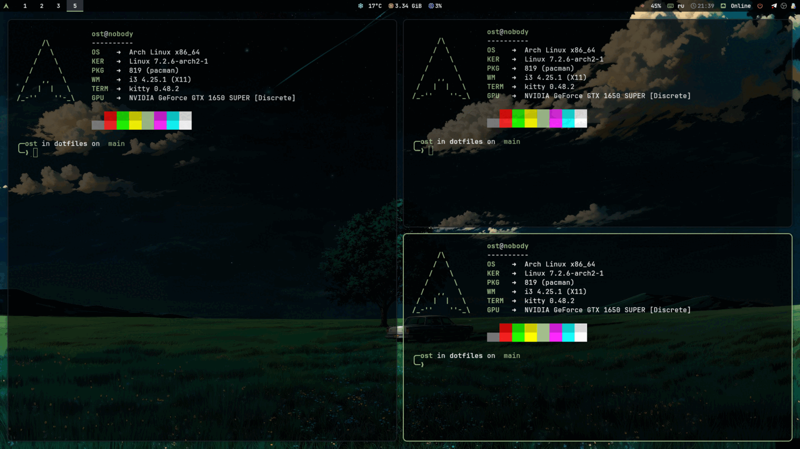
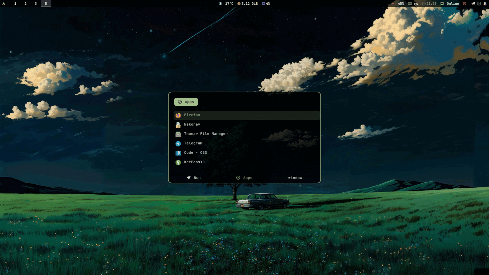

# dotfiles

i3 на Arch. Чёрный фон, один зелёный акцент, JetBrainsMono везде.





## Что внутри

i3 с гапами и автотайлингом, polybar, rofi, picom ради блюра, kitty, starship и лок-скрин, который размывает то, что было на экране. Плюс конфиги nvim, btop, fastfetch и flameshot.

## Установка

```sh
git clone https://github.com/darettau/dotfiles ~/dotfiles
cd ~/dotfiles
stow */
```

Или взять только нужное: `stow i3 kitty polybar`. Отцепить обратно — `stow -D i3`.

Stow не станет перезаписывать уже существующие файлы, так что старые конфиги нужно сначала убрать в сторону.

```sh
pacman -S i3-wm polybar rofi picom kitty neovim btop fastfetch flameshot \
          feh dex xss-lock xautolock network-manager-applet \
          maim xclip imagemagick jq eza starship \
          xorg-xrdb xorg-xsetroot xorg-xrandr xorg-xdpyinfo xorg-setxkbmap \
          xsettingsd ttf-jetbrains-mono-nerd ttf-material-design-icons-webfont
```

Лок-скрину нужен `i3lock-color` из AUR — обычный `i3lock` таких флагов не понимает.

## Дальше

Обои берутся из `~/Pictures/wallpaper.jpg` — путь можно направить куда угодно:

```sh
ln -s ~/Pictures/обои.jpg ~/Pictures/wallpaper.jpg
```

Мониторы, частота, настройки видеокарты — всё, что завязано на конкретное железо, живёт в `~/.config/i3/local.sh`, он не в репозитории:

```sh
cp ~/.config/i3/local.sh.example ~/.config/i3/local.sh
```

Polybar читает `$MONITOR`, а если переменной нет — садится на основной выход.

## Клавиши

`$mod` — это Super.

| | |
|---|---|
| `$mod+Return` | терминал |
| `$mod+r` | rofi |
| `$mod+Shift+q` | закрыть окно |
| `$mod+d` | заблокировать |
| `Print` / `$mod+Print` | скриншот / выделенная область |
| `$mod+j k l ;` | фокус влево вниз вверх вправо |
| `$mod+h` `$mod+v` | разделить |
| `$mod+f` | на весь экран |
| `$mod+s` `$mod+w` `$mod+e` | стопкой, вкладками, обратно в сплит |
| `$mod+1..0` | воркспейсы, с `Shift` — утащить окно за собой |
| `$mod+Shift+c` `$mod+Shift+r` | перечитать конфиг, перезапустить i3 |
| `Alt+Shift` | us/ru |

Новые сплиты идут по форме активного окна, так что руками `$mod+h` и `$mod+v` почти не нужны.

## Лицензия

MIT
